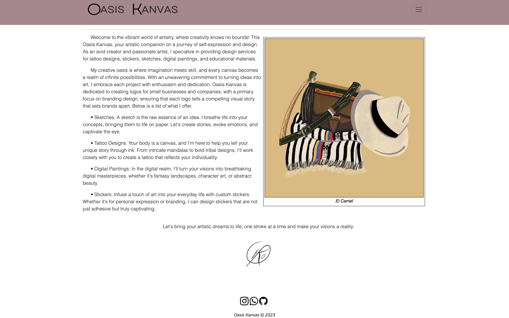
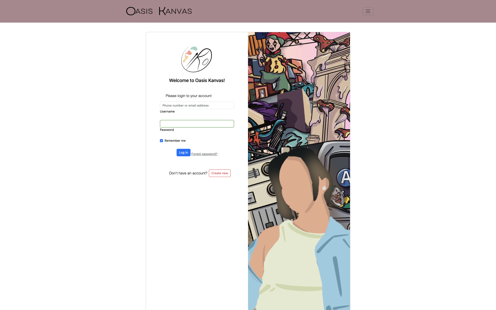
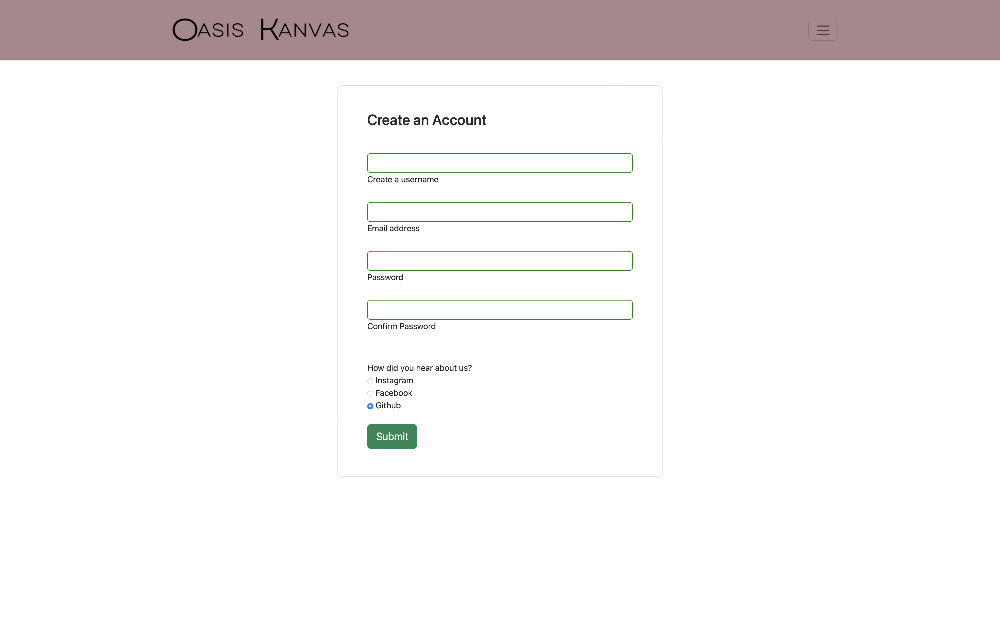
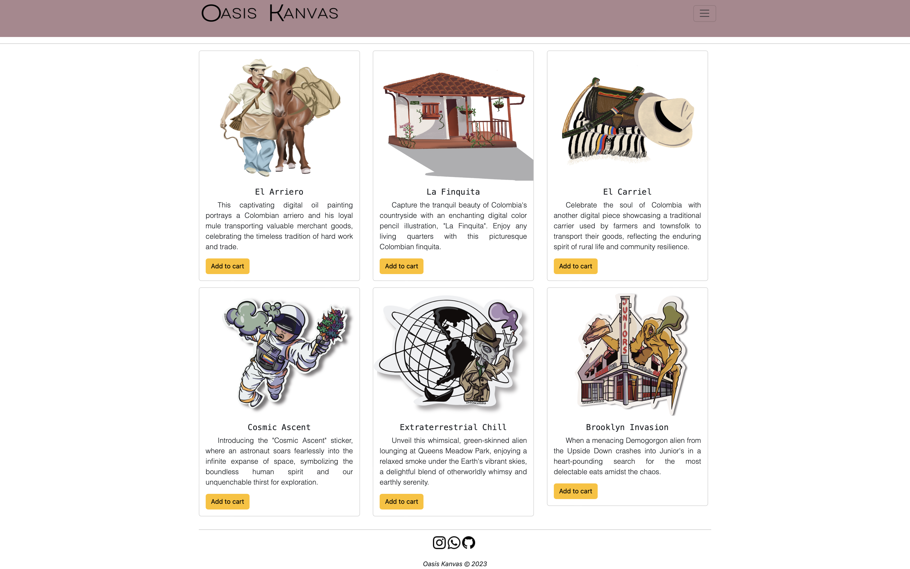
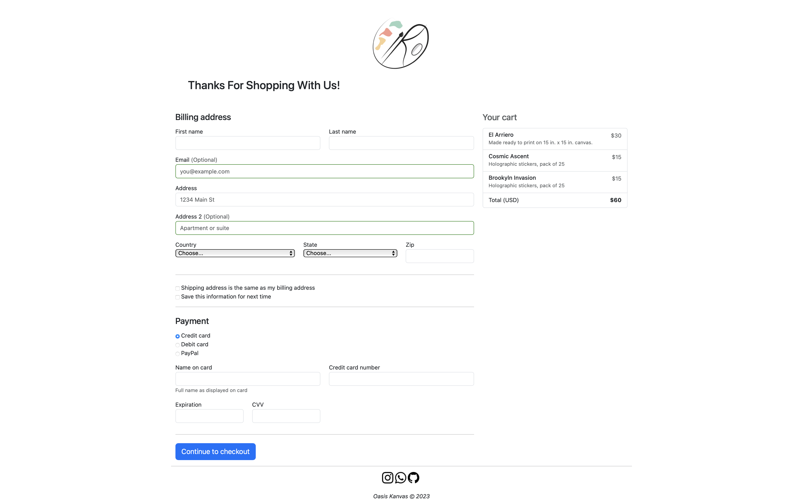

# Capstone1
YearUp
# Project Name

E-Commerce Showcase for Digital Artistry

## Description

I chose to embark on an inspiring journey to gain coding knowledge and leverage those skills to fulfill my partner's creative visiona. As she is a digital artist and graphic designer, my goal was to build an e-commerce website that would not only serve as a digital gallery for her creations but also act as a powerful platform for sharing these remarkable works with art enthusiasts worldwide.

## Table of Contents

- [Features](#features)
- [Demo](#demo)
- [Installation](#installation)

## Features

- Interactive navigational bar
- Responsive links
- User friendly compact design

## Demo

## Installation
VSCode
Terminal
Github
